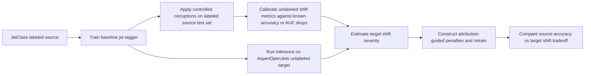
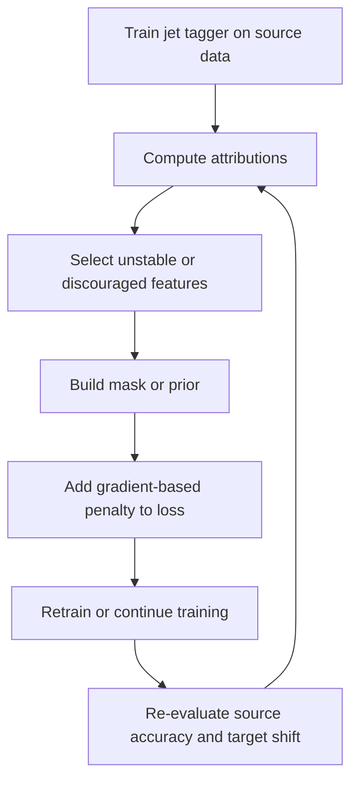
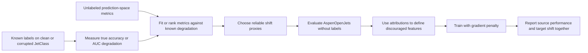

# Expanded Background

## Executive summary

Jet tagging sits at the intersection of collider physics, detector reconstruction, and modern representation learning. At the entity["point_of_interest","Large Hadron Collider","geneva, switzerland"], many important signatures appear as collimated sprays of particles whose internal structure must be used to distinguish ordinary QCD jets from jets initiated by hadronic decays of heavy objects such as W, Z, Higgs, or top states. Over the last decade, the field has moved from hand-crafted substructure observables and jet images to constituent-level set, graph, and attention-based models, culminating in large public benchmarks such as JetClass and real-data resources such as AspenOpenJets. For this project, the central methodological challenge is not just classification accuracy on simulation, but whether a model trained on simulated source data can remain reliable on unlabeled target data derived from entity["organization","CMS","lhc experiment"] Open Data. That makes three literatures directly relevant: jet tagging and public datasets, interpretability and right-for-the-right-reasons training, and domain adaptation or shift detection under missing target labels. The synthesis of these literatures motivates a two-stage strategy: first calibrate unlabeled shift metrics on controlled corruptions where labels are still known, then use attribution-guided gradient penalties to discourage reliance on features that appear predictive in simulation but unstable under target-domain shift. (Larkoski, Moult, and Nachman, 2017; Kogler et al., 2019; Qu, Li, and Qian, 2022; Amram et al., 2025; Ross, Hughes, and Doshi-Velez, 2017; Ben-David et al., 2010). citeturn19search2turn19search1turn24view0turn18view1turn34view0

The current draft’s Background is brief and organized around two subsections, one on JetClass and AspenOpenJets and one on attribution methods, but it does not fix an exact target word count or a locked bibliography. The section below therefore expands the conceptual scope rather than aiming for a literal line-by-line doubling, while prioritizing primary papers and official dataset records that are suitable for a final project report. fileciteturn0file0

## Jet tagging in particle physics

Jet tagging is the task of inferring the origin of a reconstructed jet from its observed constituents. In collider events, quarks and gluons cannot be seen directly; they shower and hadronize into many final-state particles, which are then clustered into jets. In the boosted regime, the hadronic decay products of a heavy object can merge into a single large-radius jet, so useful information comes from the jet’s internal radiation pattern rather than only from global kinematics. This is why jet substructure has become central both for precision measurements and for searches for new physics. Foundational reviews emphasize that modern jet tagging combines QCD-motivated observables, grooming, and machine learning, with the physics goal of separating signal-like multi-prong structure from generic QCD backgrounds (Larkoski, Moult, and Nachman, 2017; Kogler et al., 2019). citeturn19search2turn19search1turn24view0

Classical substructure observables remain important because they encode physically interpretable inductive biases. N-subjettiness was introduced to quantify how consistent a jet is with one, two, or three hard subjets, making ratios such as \(\tau_{21}\) and \(\tau_{32}\) effective for boosted-boson and boosted-top tagging (Thaler and Van Tilburg, 2011; Thaler and Van Tilburg, 2012). Soft Drop grooming was introduced to remove soft wide-angle radiation and stabilize jet mass and related observables against contamination from underlying event and pileup (Larkoski et al., 2014). These tools matter for the present project because they define part of the physics vocabulary for “stable” versus “unstable” features under domain shift: if a model relies on detector- or simulation-specific artifacts instead of transferable substructure, it may score well in simulation while failing on real data. citeturn21search0turn21search1turn21search2

The machine learning progression in jet tagging roughly follows the evolution of data representations. Early work treated calorimeter information as images, showing that computer vision style pipelines could learn useful discriminants beyond manually engineered observables (Cogan et al., 2015; de Oliveira et al., 2016). Later work shifted to constituent-level representations, which better respect the variable-length, unordered character of particle sets. Energy Flow Networks and Particle Flow Networks adapted permutation-invariant set architectures to jets, with EFNs enforcing infrared and collinear safety by construction and PFNs allowing more general constituent information (Komiske, Metodiev, and Thaler, 2019). ParticleNet then recast a jet as a “particle cloud” and used dynamic graph convolutions to achieve state-of-the-art performance on benchmark jet-tagging tasks (Qu and Gouskos, 2020). Attention-based and symmetry-aware successors, including ABCNet, Point Cloud Transformers, LorentzNet, and Particle Transformer, pushed further by representing pairwise relations more flexibly and by baking particle-physics symmetries into the architecture itself (Mikuni and Canelli, 2020; Mikuni and Canelli, 2021; Gong et al., 2022; Qu, Li, and Qian, 2022). citeturn23search1turn23search2turn22search3turn25view1turn26search5turn26search4turn24view3turn24view0

## Datasets and model landscape

JetClass and AspenOpenJets play different but complementary roles. JetClass is a large supervised simulation benchmark designed to make constituent-level deep learning on jets reproducible at scale. The official dataset record lists 100 million jets for training, 5 million for validation, and 20 million for testing, across 10 simulated jet classes, generated with MadGraph, Pythia, and Delphes. The accompanying Particle Transformer paper describes JetClass as a comprehensive benchmark and introduces ParT, a transformer that augments attention with pairwise particle interaction information, outperforming strong baselines such as PFN, P-CNN, and ParticleNet on the benchmark (Qu, Li, and Qian, 2022). citeturn24view1turn24view0

AspenOpenJets, by contrast, is valuable precisely because it is derived from real collider data. Amram et al. construct it from 2016 MiniAOD JetHT releases from the entity["organization","CERN","research organization"] Open Data Portal, selecting AK8 jets with \(p_T > 300\) GeV and \(|\eta| < 2.5\), and packaging the result as an ML-ready dataset of about 178 million jets. It includes constituent four-momenta, displacement information, charge, particle IDs, PUPPI weights, soft-drop mass, and N-subjettiness, but it is intended for machine learning development rather than direct precision physics claims. Crucially for this project, it is unlabeled for the JetClass 10-way task and is expected to be dominated by QCD jets, with only a relatively small admixture of boosted W, Z, and top jets. That makes AspenOpenJets an excellent target domain for sim-to-real evaluation, but an intrinsically difficult one for conventional supervised benchmarking (Amram et al., 2025; CMS Collaboration, 2024a; CMS Collaboration, 2024b). citeturn27view1turn18view1turn28search0turn28search1

This source-target pairing is therefore scientifically useful because it exposes two distinct mismatches at once. The first is detector and reconstruction shift: JetClass is fast-simulated, while AspenOpenJets traces back to real CMS data products. The second is semantic and class-prior mismatch: JetClass has explicit 10-way labels designed for supervised study, whereas AspenOpenJets has an unknown mixture dominated by unlabeled real jets. In other words, the target problem is not merely “same task, different noise,” but a harder partial-overlap transfer setting in which only unlabeled target diagnostics are directly available. That is exactly the regime in which shift estimation and explanation-guided regularization become meaningful research questions rather than cosmetic add-ons (Qu, Li, and Qian, 2022; Amram et al., 2025). citeturn24view0turn27view1turn18view1

| Name | Year | Task | Data type | Key contribution | URL |
|---|---:|---|---|---|---|
| JetClass | 2022 | 10-class jet tagging benchmark | Simulated constituent-level jets | Official large-scale public supervision benchmark, 100M train + 5M val + 20M test, 10 classes. citeturn24view1turn24view0 | `https://doi.org/10.5281/zenodo.6619768` |
| AspenOpenJets | 2024-2025 | Unlabeled real-data jet modeling and transfer | CMS Open Data derived AK8 jets | ML-ready real-data target set, about 178M jets from 2016 JetHT MiniAOD, mostly QCD-like and unlabeled for JetClass. citeturn27view1turn18view1turn28search0turn28search1 | `https://doi.org/10.25592/uhhfdm.16505` |
| EFN / PFN | 2019 | Quark-gluon and generic event tagging | Unordered particle sets | Formalized permutation-invariant set learning for jets; EFN is IRC-safe by construction. citeturn22search3turn22search6 | `https://doi.org/10.1007/JHEP01(2019)121` |
| ParticleNet | 2020 | Jet tagging | Particle clouds / dynamic graphs | Strong point-cloud baseline using DGCNN on constituent sets, with state-of-the-art benchmark performance at publication. citeturn25view1turn25view2 | `https://doi.org/10.1103/PhysRevD.101.056019` |
| Point Cloud Transformers | 2021 | Boosted-particle jet tagging | Point clouds with attention | Early transformer-style adaptation to unordered collider particles. citeturn26search4 | `https://arxiv.org/abs/2102.05073` |
| LorentzNet | 2022 | Jet tagging | Lorentz-equivariant graphs | Injects Lorentz symmetry via efficient Minkowski dot-product attention, improving data efficiency and generalization. citeturn24view3 | `https://doi.org/10.1007/JHEP07(2022)030` |
| Particle Transformer | 2022 | 10-class jet tagging | Constituent transformer with pairwise terms | Introduced ParT and showed clear gains over ParticleNet on JetClass. citeturn24view0 | `https://proceedings.mlr.press/v162/qu22b.html` |

The project workflow implied by this literature is naturally two-domain and two-stage: supervised learning on JetClass, then unlabeled diagnosis and adaptation pressure relative to AspenOpenJets. The diagram below summarizes that logic. (Qu, Li, and Qian, 2022; Amram et al., 2025). citeturn24view0turn18view1

## Interpretability and right-for-the-right-reasons

The interpretability methods most relevant here are gradient-based attributions, because they operate directly on differentiable constituent-level models and can be integrated into training objectives. Saliency maps or input gradients compute derivatives of a target score with respect to the input, turning local sensitivity into a feature-importance proxy (Simonyan, Vedaldi, and Zisserman, 2014). Integrated Gradients addresses some shortcomings of raw gradients by integrating along a path from a baseline to the actual input, and it is motivated by axioms such as sensitivity and implementation invariance (Sundararajan, Taly, and Yan, 2017). SmoothGrad reduces visual and numerical noise by averaging gradient explanations over noisy perturbations of the same input (Smilkov et al., 2017). In a constituent-level jet model, these methods answer related but not identical questions: which particle features most affect the current score locally, which features matter relative to a baseline, and which signals remain stable after local denoising. citeturn36search0turn36search2

For a project concerned with “right for the right reasons,” the key point is that explanations are not merely post hoc diagnostics. They can also be turned into training signals. Early right-for-the-right-reasons work proposed discouraging high input-gradient magnitude on features judged irrelevant or undesirable, thereby shaping a model’s inductive bias rather than only auditing it after training. Follow-up work showed that explanation-based penalties can improve robustness to spurious correlations, encourage sparsity or smoothness in attributions, and encode prior knowledge directly into the learning objective (Ross and Doshi-Velez, 2018; Rieger et al., 2020; Erion et al., 2021). In practice, this means that if one suspects certain constituent channels, regions, or feature combinations are especially domain-specific, then attribution-constrained training offers a principled way to discourage reliance on them. citeturn31search0turn35view6

That said, explanation-guided training inherits the weaknesses of the explanation method itself. Raw gradients can saturate or become noisy, baseline-dependent methods like Integrated Gradients require a meaningful reference input, and denoising methods such as SmoothGrad can improve visual stability without guaranteeing causal faithfulness. More broadly, the interpretability literature has shown that saliency methods can look plausible even when they are fragile to model changes or insensitive to model parameters, which is why attribution quality must be validated rather than assumed. For this project, that validation logic is especially important because the masks used in regularization are themselves generated from attributions, so poor attribution fidelity would feed back into training. (Simonyan, Vedaldi, and Zisserman, 2014; Sundararajan, Taly, and Yan, 2017; Smilkov et al., 2017). citeturn36search0turn36search2

A schematic training loop is shown below. It captures the idea of using explanations not only to inspect the model, but to iteratively reshape what the model is allowed to rely on. (Rieger et al., 2020; Erion et al., 2021). citeturn31search0turn35view6

## Domain adaptation and sim-to-real transfer

The domain adaptation literature provides the formal backdrop for why this project is hard. In classical theory, target error is controlled not only by source error, but also by a divergence term between source and target distributions and by the existence, or nonexistence, of a hypothesis that performs well on both domains. Ben-David et al. showed that unlabeled samples from the two domains can be used to estimate classifier-induced discrepancy measures, which makes target-shift reasoning possible even before target labels are available. At the algorithmic level, unsupervised domain adaptation methods such as domain-adversarial neural networks encourage representations that are predictive for the source task and simultaneously less domain-discriminative for the source-target split (Ben-David et al., 2010; Ganin and Lempitsky, 2015). citeturn34view0turn6search10

In high energy physics, the sim-to-real version of this problem is especially acute because simulation is indispensable for labels, yet never perfect. Public HEP studies have already demonstrated this tension. Baalouch et al. explicitly studied sim-to-real transfer using a DANN on public HEP data. Clavijo et al. used adversarial domain adaptation to reduce sample bias in an unsupervised HEP classification setting. The CMS displaced-jet tagger likewise used backward-propagation domain adaptation to improve agreement between simulation and collision-data output distributions. These examples show that sim-to-real transfer in HEP is not a hypothetical concern, but an operational one: the community already treats mismatch between Monte Carlo and data as a problem that can and should influence model design (Baalouch et al., 2019; Clavijo et al., 2022; CMS Collaboration, 2020). citeturn7search0turn8search1turn14search0turn14search11

A second relevant literature concerns shift detection when the target labels are missing. Under covariate shift, the input distribution changes while the conditional \(p(y \mid x)\) is assumed unchanged; under label shift, the class prior changes while class-conditionals are assumed stable. Importance weighting, kernel mean matching, and black-box shift estimation are central tools in these settings (Sugiyama, Krauledat, and Müller, 2007; Gretton et al., 2009; Lipton, Wang, and Smola, 2018). More general dataset-shift work studies two-sample testing, discrepancy measures between source and target, and the usefulness of classifier-output reductions for practical detection (Rabanser, Günnemann, and Lipton, 2019). This project’s prediction-space metrics, such as class-distribution JS divergence, top-1 histogram drift, confidence drop, and entropy shift, fit squarely into that black-box detection tradition because they can be computed on unlabeled target data with only model outputs in hand (Lin, 1991; Hendrycks and Gimpel, 2017; Ovadia et al., 2019). citeturn34view2turn11search0turn11search3turn35view2turn35view5turn12search1turn35view3

An important caution from the broader ML literature is that not every discrepancy metric predicts performance loss well. Rabanser et al. found that shift detection and shift malignancy are related but distinct questions, and Guillory et al. showed that many seemingly natural distributional distances can fail to track accuracy change on unseen distributions, whereas carefully designed confidence-based summaries can do better. This caution strongly supports the present project’s calibration step: rather than assuming that a metric like JS divergence or confidence drop has a monotonic, portable relationship to target accuracy, the metric should first be ranked or calibrated on controlled corruptions where supervised degradation is still measurable (Rabanser, Günnemann, and Lipton, 2019; Guillory et al., 2021; Hendrycks and Dietterich, 2019). citeturn11search2turn29search0turn32search0

## Motivation, limitations, and open questions

These literatures together motivate the project’s specific design very naturally. JetClass provides labeled source supervision and a modern transformer benchmark. AspenOpenJets provides an unlabeled but realistic target domain whose mismatch from simulation is scientifically meaningful rather than synthetic. Because direct target accuracy is unavailable, the first task is to build unlabeled diagnostics that respond in a calibrated way to degradation under controlled source-side corruptions. Because drift detection alone does not improve robustness, the second task is to alter the training objective so that the model shifts away from features suspected to be unstable across domains. Attribution-guided gradient penalties are appealing here because they are local, differentiable, architecture-agnostic, and interpretable in constituent-feature space. The resulting pipeline is not purely domain adaptation and not purely interpretability, but a hybrid: estimate where the model seems brittle, then regularize it away from those brittle explanatory pathways. fileciteturn0file0 citeturn24view0turn27view1turn29search0turn31search0turn35view6

This hybrid framing also clarifies what the project can and cannot claim. It can claim to reduce *apparent* or *diagnosed* shift on an unlabeled target, if the calibrated metrics move in the desired direction. It cannot directly claim improved AspenOpenJets classification accuracy unless target labels, or very strong external validation, become available. Likewise, a reduction in prediction drift could reflect greater domain invariance, but it could also reflect collapse toward overly conservative predictions if source performance falls too much. That is why the source-domain accuracy or AUC tradeoff is not a secondary detail but part of the core scientific result. A model that is slightly less accurate on JetClass but materially less sensitive to source-target mismatch may still be preferable, depending on the deployment objective and on how one values calibration versus nominal in-domain performance (Ben-David et al., 2010; Ovadia et al., 2019; Guillory et al., 2021). citeturn34view0turn35view3turn29search0

Several open questions remain. First, the target is unlabeled, so metric calibration may extrapolate outside the corruption regime used for source-side stress tests. Second, JetClass-to-AspenOpenJets shift includes label-space and class-prior mismatch, not just covariate shift, because the target sample is mostly QCD-like and not organized as a balanced 10-class benchmark. Third, attribution-guided penalties depend on the faithfulness and stability of the attribution method, which may vary across seeds, architectures, and baselines. Fourth, there is a genuine accuracy-robustness tradeoff: suppressing domain-specific features may also suppress some genuinely discriminative physics information. Finally, the method is computationally expensive because attribution estimation and retraining are nested. These are not reasons to avoid the approach, but they do define the scope of the claims that a final report should make. fileciteturn0file0 citeturn18view1turn27view1turn35view3turn29search0turn31search0turn35view6

A final schematic emphasizes the intended logic of the experiment: stress test first, then regularize, then read the result as a tradeoff rather than as a guaranteed monotonic improvement. fileciteturn0file0 citeturn29search0turn31search0

## References

- Amram, O., Anzalone, L., Birk, J., Faroughy, D. A., Hallin, A., Kasieczka, G., Krämer, M., Pang, I., Reyes-Gonzalez, H., & Shih, D. (2025). *Aspen Open Jets: Unlocking LHC Data for Foundation Models in Particle Physics*. *Machine Learning: Science and Technology*, 6(3), 030601. URL: `https://arxiv.org/abs/2412.10504` and dataset URL: `https://doi.org/10.25592/uhhfdm.16505`. citeturn16search3turn17search8turn17search5

- Ben-David, S., Blitzer, J., Crammer, K., Kulesza, A., Pereira, F., & Vaughan, J. W. (2010). *A theory of learning from different domains*. *Machine Learning*, 79, 151-175. URL: `https://doi.org/10.1007/s10994-009-5152-4`. citeturn34view0

- Cogan, J., Kagan, M., Strauss, E., & Schwartzman, A. (2015). *Jet-Images: Computer Vision Inspired Techniques for Jet Tagging*. *JHEP*, 02, 118. URL: `https://arxiv.org/abs/1407.5675`. citeturn23search1turn23search4

- Clavijo, J. M., Glaysher, P., Jitsev, J., & Katzy, J. M. (2022). *Adversarial domain adaptation to reduce sample bias of a high energy physics classifier*. *Machine Learning: Science and Technology*, 3, 015014. URL: `https://arxiv.org/abs/2005.00568`. citeturn8search1turn10search10

- CMS Collaboration. (2020). *A deep neural network to search for new long-lived particles decaying to jets*. *Machine Learning: Science and Technology*, 1, 035012. URL: `https://arxiv.org/abs/1912.12238`. citeturn14search0turn14search2

- CMS Collaboration. (2024a, 2024b). *JetHT primary dataset in MINIAOD format from RunG and RunH of 2016*. CERN Open Data Portal. URLs: `https://opendata.cern.ch/record/30508` and `https://opendata.cern.ch/record/30541`. citeturn28search0turn28search1

- de Oliveira, L., Kagan, M., Mackey, L., Nachman, B., & Schwartzman, A. (2016). *Jet-Images -- Deep Learning Edition*. *JHEP*, 07, 069. URL: `https://arxiv.org/abs/1511.05190`. citeturn23search2turn23search11

- Erion, G., Janizek, J. D., Sturmfels, P., Lundberg, S. M., & Lee, S.-I. (2021). *Improving performance of deep learning models with axiomatic attribution priors and expected gradients*. *Nature Machine Intelligence*, 3, 620-631. URL: `https://doi.org/10.1038/s42256-021-00343-w`. citeturn30search0turn35view6

- Ganin, Y., & Lempitsky, V. (2015). *Unsupervised Domain Adaptation by Backpropagation*. URL: `https://arxiv.org/abs/1409.7495`. citeturn6search10

- Guillory, D., Shankar, V., Ebrahimi, S., Darrell, T., & Schmidt, L. (2021). *Predicting with Confidence on Unseen Distributions*. ICCV 2021. URL: `https://arxiv.org/abs/2107.03315`. citeturn29search0turn29search1

- Hendrycks, D., & Dietterich, T. (2019). *Benchmarking Neural Network Robustness to Common Corruptions and Perturbations*. ICLR 2019. URL: `https://arxiv.org/abs/1903.12261`. citeturn32search0

- Hendrycks, D., & Gimpel, K. (2017). *A Baseline for Detecting Misclassified and Out-of-Distribution Examples in Neural Networks*. ICLR 2017. URL: `https://arxiv.org/abs/1610.02136`. citeturn12search1turn35view4

- Kogler, R., Nachman, B., Schmidt, A., Asquith, L., Campanelli, M., Delitzsch, C., Harris, P., Hinzmann, A., Kar, D., McLean, C., et al. (2019). *Jet substructure at the Large Hadron Collider*. *Reviews of Modern Physics*, 91, 045003. URL: `https://doi.org/10.1103/RevModPhys.91.045003`. citeturn19search1

- Komiske, P. T., Metodiev, E. M., & Thaler, J. (2019). *Energy Flow Networks: Deep Sets for Particle Jets*. *JHEP*, 01, 121. URL: `https://arxiv.org/abs/1810.05165`. citeturn22search3turn22search6

- Larkoski, A. J., Marzani, S., Soyez, G., & Thaler, J. (2014). *Soft Drop*. *JHEP*, 05, 146. URL: `https://arxiv.org/abs/1402.2657`. citeturn21search2turn21search10

- Larkoski, A. J., Moult, I., & Nachman, B. (2017). *Jet Substructure at the Large Hadron Collider: A Review of Recent Advances in Theory and Machine Learning*. URL: `https://arxiv.org/abs/1709.04464`. citeturn19search2

- Lin, J. (1991). *Divergence measures based on the Shannon entropy*. *IEEE Transactions on Information Theory*, 37(1), 145-151. URL: `https://doi.org/10.1109/18.61115`. citeturn13search0turn13search5

- Lipton, Z. C., Wang, Y.-X., & Smola, A. (2018). *Detecting and Correcting for Label Shift with Black Box Predictors*. ICML 2018. URL: `https://arxiv.org/abs/1802.03916`. citeturn11search3turn11search7

- Mikuni, V., & Canelli, F. (2020). *ABCNet: An attention-based method for particle tagging*. *European Physical Journal Plus*, 135, 463. URL: `https://arxiv.org/abs/2001.05311`. citeturn26search5turn26search16

- Mikuni, V., & Canelli, F. (2021). *Point Cloud Transformers applied to Collider Physics*. *Machine Learning: Science and Technology*, 2, 035027. URL: `https://arxiv.org/abs/2102.05073`. citeturn26search4

- Ovadia, Y., Fertig, E., Ren, J., Nado, Z., Sculley, D., Nowozin, S., Dillon, J. V., Lakshminarayanan, B., & Snoek, J. (2019). *Can you trust your model’s uncertainty? Evaluating predictive uncertainty under dataset shift*. NeurIPS 2019. URL: `https://proceedings.neurips.cc/paper/9547-can-you-trust-your-models-uncertainty-evaluating-predictive-uncertainty-under-dataset-shift`. citeturn12search0turn35view3

- Qu, H., & Gouskos, L. (2020). *ParticleNet: Jet Tagging via Particle Clouds*. *Physical Review D*, 101, 056019. URL: `https://arxiv.org/abs/1902.08570`. citeturn25view1

- Qu, H., Li, C., & Qian, S. (2022). *Particle Transformer for Jet Tagging*. ICML 2022, PMLR 162:18281-18292. URL: `https://proceedings.mlr.press/v162/qu22b.html`. Dataset URL: `https://doi.org/10.5281/zenodo.6619768`. citeturn24view0turn24view1

- Rabanser, S., Günnemann, S., & Lipton, Z. C. (2019). *Failing Loudly: An Empirical Study of Methods for Detecting Dataset Shift*. URL: `https://arxiv.org/abs/1810.11953`. citeturn11search2turn11search10

- Rieger, L., Singh, C., Murdoch, W. J., & Yu, B. (2020). *Interpretations are useful: penalizing explanations to align neural networks with prior knowledge*. ICML 2020. URL: `https://arxiv.org/abs/1909.13584`. citeturn31search0turn31search1

- Ross, A. S., & Doshi-Velez, F. (2018). *Improving the Adversarial Robustness and Interpretability of Deep Neural Networks by Regularizing their Input Gradients*. AAAI 2018. URL: `https://arxiv.org/abs/1711.09404`. citeturn4search1

- Simonyan, K., Vedaldi, A., & Zisserman, A. (2014). *Deep Inside Convolutional Networks: Visualising Image Classification Models and Saliency Maps*. ICLR Workshop 2014. URL: `https://arxiv.org/abs/1312.6034`. citeturn36search0turn36search8

- Smilkov, D., Thorat, N., Kim, B., Viégas, F., & Wattenberg, M. (2017). *SmoothGrad: removing noise by adding noise*. URL: `https://arxiv.org/abs/1706.03825`. citeturn36search2

- Sugiyama, M., Krauledat, M., & Müller, K.-R. (2007). *Covariate Shift Adaptation by Importance Weighted Cross Validation*. *Journal of Machine Learning Research*, 8, 985-1005. URL: `https://www.jmlr.org/papers/v8/sugiyama07a.html`. citeturn11search1turn34view2

- Sundararajan, M., Taly, A., & Yan, Q. (2017). *Axiomatic Attribution for Deep Networks*. ICML 2017. URL: `https://proceedings.mlr.press/v70/sundararajan17a.html`. citeturn3search1

- Thaler, J., & Van Tilburg, K. (2011). *Identifying Boosted Objects with N-subjettiness*. *JHEP*, 03, 015. URL: `https://arxiv.org/abs/1011.2268`. citeturn21search0turn21search4

- Thaler, J., & Van Tilburg, K. (2012). *Maximizing Boosted Top Identification by Minimizing N-subjettiness*. *JHEP*, 02, 093. URL: `https://arxiv.org/abs/1108.2701`. citeturn21search1turn21search9